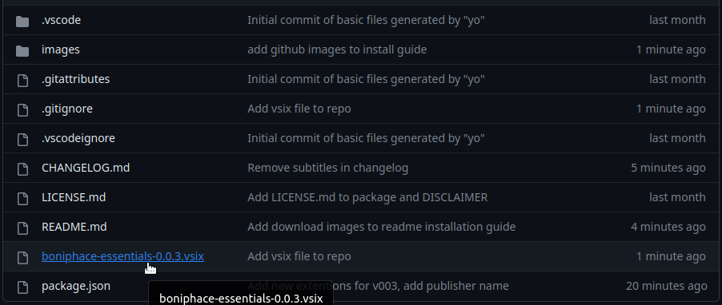
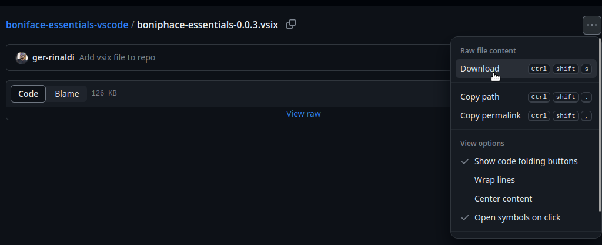
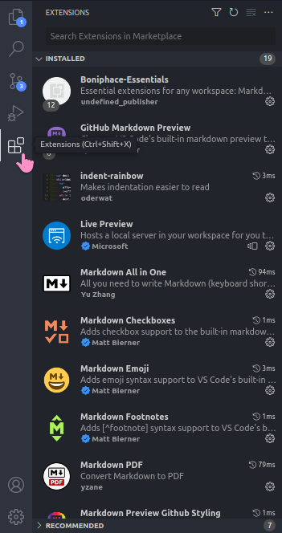
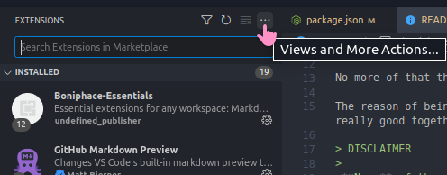
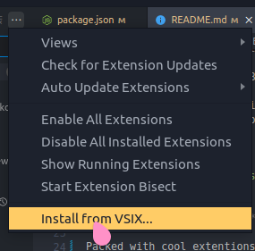

# boniphace-essentials README

## Easy starting setup

Do you have several VSCode profiles?

Do some extensions appear in different profiles?

Have YOU tried to manage that?

"Oh, ohno, I forgot to install X in my Y profile!"

No more of that thanks to Boniphace Essentials!

The reason of being for this package is to ease setting up a new profile with basic extentions that are not usually bundled but that are really good together! If you see this pack, I hope you like and enjoy it!

> DISCLAIMER
>
>**None** of the extentions used are of my creation, credits to creators below.
>This is just a bundle.

## Extentensions I **love** and **need**

Packed with cool extentions you may find quite useful! This package is mainly focused in Markdown and PlantUML, these are extensions I find quite useful in, many profiles geared towards writing documentation or that need documentation capabilities!

## How to install

- Download the `.vsix` file (this is the installed for the package)

- Go to VS Code and select your desired profile
- Go to Extensions in Activity Bar

- Click on `Views and More Actions...`

- Click on `Install from VSIX`

- Find your VSIX and click install and you're done!

In case you prefer not to install from the `.vsix` directly and you'd rather [make it yourself](https://medium.com/@sanik.bajracharya/vscode-how-to-create-your-own-extension-pack-483385644c29)

### Extensions, creators and IDs

#### Live Server

- By:  Microsoft
- **ID:** ms-vscode.live-server

#### GitHub Markdown Preview

- By:  Matt Bierner
- **ID:** bierner.github-markdown-preview

#### Markdown All in One

- By:  Yu Zhang
- **ID:** yzhang.markdown-all-in-one

#### Markdown Lint

- By:  David Anson
- **ID:** DavidAnson.vscode-markdownlint

#### Path Intellisense

- By:  Christian Kohler
- **ID:** christian-kohler.path-intellisense

#### Indent Rainbow

- By:  Oderwat
- **ID:** oderwat.indent-rainbow

#### VSCode Pets

- By:  Anthony Shaw
- **ID:** tonybaloney.vscode-pets

#### Material Icon Theme

- By:  Phillip Kief
- **ID:** PKief.material-icon-theme

#### One Monokai Theme

- By:  Joshua Azemoth
- **ID:** azemoh.one-monokai

#### TODO Highlight

- By:  Wayou Liu
- **ID:** wayou.vscode-todo-highlight

#### Prettier

- By:  Prettier
- **ID:** esbenp.prettier-vscode

#### Markdown PDF

- By:  Yzane
- **ID:** yzane.markdown-pdf

#### VSCode PDF

- By:  tomoki1207
- **ID:** tomoki1207.pdf

#### PlantUML

- By:  jebbs
- **ID:** jebbs.plantuml

#### Better Comments

- By:  aaron-bond
- **ID:** aaron-bond.better-comments

Thanks to all of them for these amazing extensions!
